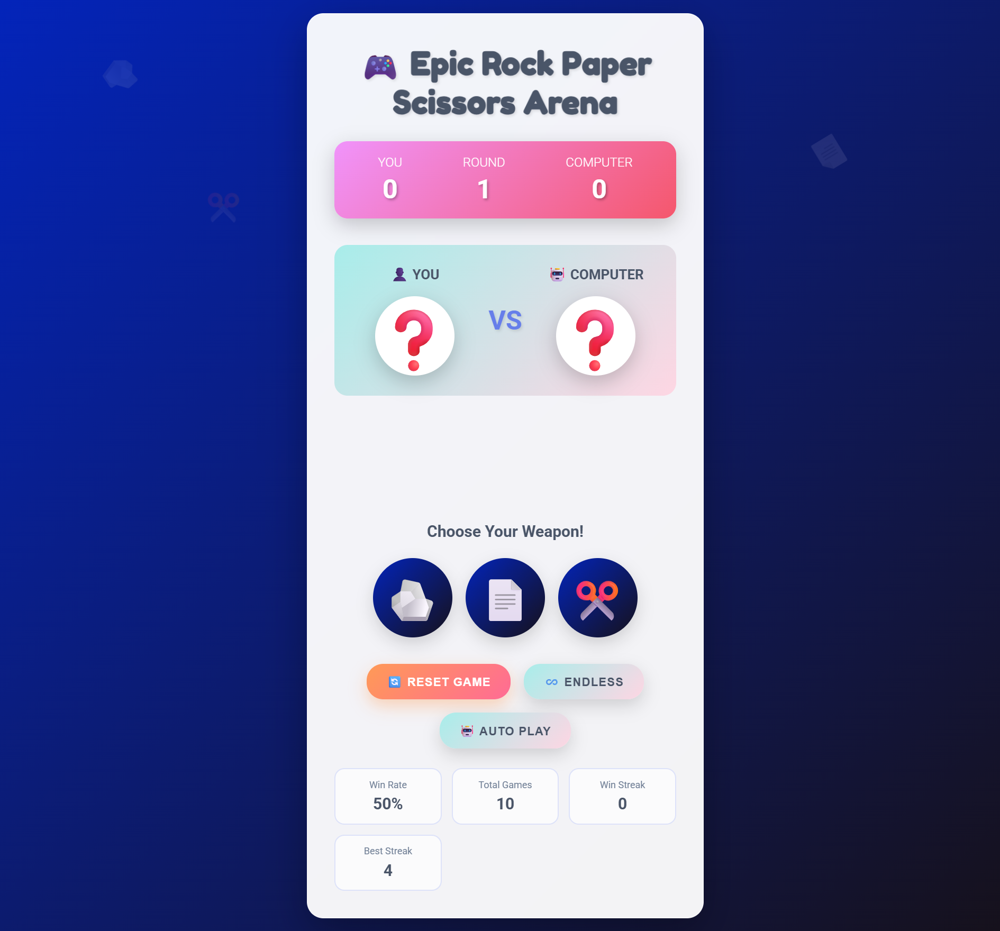

# 🎮 Epic Rock Paper Scissors Arena

A modern, interactive Rock Paper Scissors game built with vanilla JavaScript, featuring smooth animations, keyboard controls, and persistent statistics.



---

## 🎮 Live Demo
👉 [Pl Now](https://yourusername.github.io/rock-paper-scissors-arena/)

---

## ✨ Features

- **🎯 Two Game Modes**: Play endless rounds or compete in Best of 5
- **⌨️ Keyboard Controls**: Full keyboard support for quick gameplay
- **📊 Live Statistics**: Track your win rate, streaks, and total games
- **🤖 Auto Play Mode**: Watch the game play itself
- **💾 Persistent Data**: Your stats are saved using localStorage
- **🎨 Modern UI**: Beautiful gradients and smooth animations
- **📱 Fully Responsive**: Works perfectly on all devices
- **♿ Accessible**: ARIA labels and semantic HTML

## 🎮 How to Play

### Mouse/Touch
Click on Rock (🪨), Paper (📄), or Scissors (✂️) to make your choice.

### Keyboard Controls
- `R` or `1` → Choose Rock
- `P` or `2` → Choose Paper
- `S` or `3` → Choose Scissors
- `Space` or `Enter` → Random choice
- `Escape` → Reset game

## 🚀 Quick Start

### Option 1: Direct Download
1. Download or clone this repository
2. Open `index.html` in your browser
3. Start playing!

### Option 2: Local Server (Recommended)
```bash
# Using Python 3
python -m http.server 8000

# Using Node.js (http-server)
npx http-server

# Using PHP
php -S localhost:8000

Then open `http://localhost:8000` in your browser.
```

## 📁 Project Structure

```bash
rock-paper-scissors-arena/
├── index.html          # Main HTML file
├── README.md           # Documentation
├── LICENSE             # MIT License
├── .gitignore          # Git ignore file
└── src/
├── css/
│   ├── style.css       # Main styles
│   └── animations.css  # Animation styles
└── js/
├── game.js         # Main game logic
└── utils.js        # Utility functions
```

## 🛠️ Technologies Used

- **HTML5**: Semantic markup
- **CSS3**: Custom properties, Grid, Flexbox, animations
- **JavaScript ES6+**: Modules, classes, async/await
- **LocalStorage API**: Data persistence

## 🎯 Game Rules

- Rock crushes Scissors
- Paper covers Rock
- Scissors cuts Paper
- Same choice = Tie

## 📊 Statistics Tracked

- **Win Rate**: Percentage of games won
- **Total Games**: Total number of games played
- **Win Streak**: Current consecutive wins
- **Best Streak**: Highest win streak achieved

## 🎨 Features in Detail

### Smart AI
The computer uses a weighted algorithm that slightly favors choices that would have beaten your last choice, making it more challenging.

### Auto Play Mode
Watch the game play itself automatically - perfect for testing or entertainment.

### Best of 5 Mode
Compete in a best-of-5 match where first to 3 wins takes the victory.

## 🤝 Contributing

Contributions are welcome! Feel free to:
- Report bugs
- Suggest new features
- Submit pull requests

## 📝 License

This project is licensed under the MIT License.

## 👨‍💻 Author

**Mehdi-dev-sudo**
- GitHub: [@Mehdi-dev-sudo](https://github.com/Mehdi-dev-sudo)

## 🙏 Acknowledgments

- Emoji icons from Unicode Standard
- Fonts from Google Fonts
- Inspiration from classic Rock Paper Scissors games

---

**Enjoy the game! May the odds be ever in your favor! 🎲**
